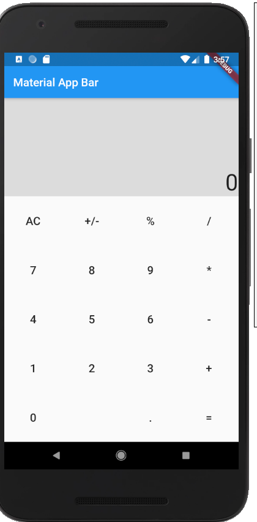

# Simple Calculator Layout in Flutter

## why this project is useful?
* This project gives you overview of how to use rows and column.
* Best use of Expanded class
* Overview of Code Reuseability

## ScreenShot:

